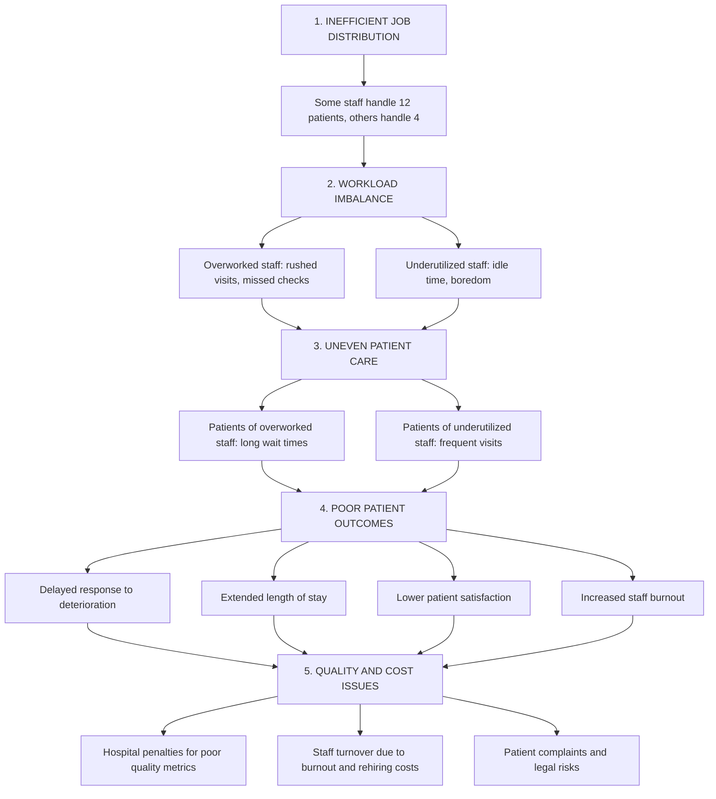

# leanonme
SYSEN 5300 Hackathon Team: Lean on Me Fall 2025
# Lean On Me: Inpatient Wait Time Quality Control System

## Background

Nestled in a quiet corner of rural New York, our hospital is small but mighty. With just 80 beds, 2 dedicated doctors, and a team of 9 nurses, we serve a tight-knit community that relies on us for compassionate and consistent care. But like many under-resourced facilities, we face challenges that larger hospitals often overlook—especially when it comes to coordinating staff across floors.

Patients have increasingly voiced concerns about long and unpredictable gaps between staff visits during their inpatient stays. These delays not only affect their perception of care but can also lead to extended hospitalizations and missed treatment opportunities. With limited personnel and no existing system to track these interactions, we knew something had to change.

That’s why our team developed **Lean On Me**—a lightweight, data-driven quality control system designed to monitor inpatient wait times, flag excessive delays, and empower staff to respond more efficiently. Built during the SYSEN 5300 Hackathon, this tool simulates hospital workflows using synthetic data and applies Six Sigma principles to help small hospitals like ours deliver big improvements in care.


## Project Scope
To build a lightweight, data-driven tool that tracks inpatient wait times, identifies excessive delays in staff visits, and provides actionable alerts to improve care quality and responsiveness.

## 📊 Problem Flow: Why We Built Lean On Me

## System Logic

**Inputs:**
- Patient wait times
- Minimum of 2 staff visits required before discharge
- Threshold for excessive wait time (to be defined)

**Outputs:**
- Flagged patients who need immediate attention
- Alerts for staff to prioritize visits
- Improved discharge readiness and care balance


## Features
- Synthetic data generation for patient and staff activity
- Real-time tracking of wait times between visits
- Alert system for excessive delays
- Visualizations including heatmaps and time-series charts
- Quality control logic using Six Sigma principles

## Inputs
- `patient_id`, `room_number`, `check_in_time`, `discharge_time`
- `staff_id`, `visit_time`, `patient_id`, `role`
- Optional: `floor_id`, `acuity_level`, `staff_schedule`

## Outputs
- Average and maximum wait times per patient
- Alerts for patients exceeding wait thresholds
- Visual dashboards for hospital staff
- Control charts and statistical summaries

## Installation
```r
# Install devtools if needed
install.packages("devtools")

# Install the package from GitHub
devtools::install_github("BradleyMatican25/leanonme")
