# Nurse Ticktock: Real-Time Staff Rebalancing Cuts Patient Wait Times by 40%

**SYSEN 5300 Six Sigma Hackathon 2025 - Cornell University**

[](https://www.r-project.org/)
[](https://shiny.rstudio.com/)
[](LICENSE)

---

## 📋 Table of Contents

### How to use the Dashboard
- Data Requirements[(#Data-Requirements)](https://github.com/BradleyMatican25/leanonme/tree/main#-data-requirements)
- Installation & Setup[(#Installation-Setup)][(https://github.com/BradleyMatican25/leanonme/tree/main#-installation--setup)]
- How to Use the Dashboard[(#How-to-Use-the-Dashboard)][(https://github.com/BradleyMatican25/leanonme/tree/main#-how-to-use-the-dashboard)]

### Nurse Ticktock's Background
- Backstory: From Crisis to Solution[(#backstory-from-crisis-to-solution)][(https://github.com/BradleyMatican25/leanonme/tree/main#-backstory-from-crisis-to-solution)]
- Problem Statement & Project Scope[(#problem-statement-project-scope)][(https://github.com/BradleyMatican25/leanonme/tree/main#-problem-statement--project-scope)]
- Solution Overview[(#solution-overview)][(https://github.com/BradleyMatican25/leanonme/tree/main#-solution-overview)]
- Impact & Results[(#impact--results)][(https://github.com/BradleyMatican25/leanonme/tree/main#-impact--results)]
- Six Sigma Methodology][(#six-sigma-methodology)][(https://github.com/BradleyMatican25/leanonme/tree/main#-six-sigma-methodology)]
- Critical Assumptions[(#critical-assumptions)][(https://github.com/BradleyMatican25/leanonme/tree/main#-critical-assumptions)]
- Stakeholder Details & Use Cases[(#stakeholder-details--use-cases)][(https://github.com/BradleyMatican25/leanonme/tree/main#-stakeholder-details--use-cases)]
- Team[(#team)[(https://github.com/BradleyMatican25/leanonme/tree/main#-team)]


---

## 🏥 Backstory: From Crisis to Solution

### The Crisis at St. Mary's Hospital

St. Mary's Hospital sits on the outskirts of Ithaca, New York—a 130-bed community hospital serving both rural residents and the college town surrounding it. For over 40 years, the hospital has been a trusted anchor of healthcare in the region, known for compassionate care and deep community relationships. The nursing staff—many of whom grew up locally—are proud of their work and deeply committed to their patients.

**But in 2024, something began to break.**

---

### The Patient Complaint Crisis

#### The Numbers Don't Lie

In February 2025, Chief Nursing Officer Patricia Rodriguez was reviewing monthly patient satisfaction surveys when a pattern emerged. Patient complaints about nursing wait times had begun appearing with alarming frequency:

| Month | Complaints |
|-------|-----------|
| **February 2025** | 5 complaints |
| **May 2025** | 8 complaints |
| **August 2025** | 15 complaints |
| **September 2025** | 18 complaints |

**In just 7 months, patient complaints about nursing responsiveness had tripled.**

#### Real Patient Voices

> *"I pressed my call button at 9 AM. The nurse didn't come until 5 PM. I needed pain medication. I was terrified something was wrong."*  
> — Patient P042, Post-Op Day 2

> *"Why does a patient two rooms over get checked every 2 hours, but I haven't seen my nurse in 6 hours?"*  
> — Patient P087, Post-Op Day 3

> *"The night shift nurse was wonderful, came frequently. Day shift nurse: nothing. No explanation. Very frustrating."*  
> — Patient P101, Recovery Day 1

These weren't complaints about poor nursing skill. These were complaints about **unpredictable, irregular care patterns** that created patient anxiety and delayed treatment.

#### The Clinical Impact

The hospital's Quality & Safety Committee began investigating. What they found was alarming:

- **Preventable complications**: 3 patients required extended stays due to delayed pain assessments leading to complications (muscle atrophy, psychological distress)
- **Medication delays**: 8 patients had >2-hour delays in receiving scheduled medications
- **Missed assessments**: Patients' conditions changed (fever, wound redness) but weren't caught for 4-8 hours
- **Extended stays**: ~12 patients per month stayed an extra 1-2 days due to delayed discharge coordination

**The cost?** Each extended stay cost ~$1,385/day in unnecessary charges.
```
12 stays × $1,385/month = $16,620/month in preventable costs
Annual: $199,440 in wasted resources
```

But the financial impact paled in comparison to the human impact—**patients suffering because of poor care coordination.**

---

### The Nurse Burnout Crisis

Around the same time, CNO Rodriguez noticed another alarming trend: **nurses were leaving.**

#### The Turnover Numbers

| Year | Nurses Departed | Turnover Rate |
|------|----------------|---------------|
| **2022** | 2 nurses | 13.5% (below industry average) |
| **2023** | 2 nurses | 13.5% (stable) |
| **2024** | 4 nurses by September | **44% annualized** (well above 15% average) |

By September 2024, two experienced nurses had left, one semi-retired, and one was on stress leave. In exit interviews, they all said the same thing:

#### Exit Interview - Nurse Sarah (12 years at St. Mary's)

> *"I love this hospital. I love the patients and my colleagues. But I'm exhausted. On my shifts, I'm assigned 12 patients. On Sarah's shift, she gets 4. I'm drowning. I spend half my day behind on medication times, unable to answer call lights, feeling guilty that I can't give the quality care I want to give. My family deserves me too. After 12 years, I can't do this anymore."*

#### Exit Interview - Nurse Miguel (8 years at St. Mary's)

> *"The problem isn't the hospital. The problem is that some days I have 4 patients, some days 12. There's no rhyme or reason. When I have 12, I can't even take a lunch break. When I have 4, I feel like I'm not pulling my weight. It's unpredictable and stressful. I found a job at a larger hospital with better scheduling systems. It's more 'corporate,' but at least I know what to expect."*

#### The Cost of Turnover

Healthcare staffing experts (Nursing Solutions Inc., 2024) estimate the cost to replace one nurse at **$49,000-$88,000** when including:

- Recruitment agencies (15-20% of salary)
- Training and orientation (120-160 hours of charge nurse time)
- Productivity loss during ramp-up (new nurses 30-50% slower for 3-6 months)
- Turnover of replacement candidate (some don't stay)

**For St. Mary's:** 4 departures × $88,000 = **$352,000 in turnover costs annually**

Add to that: recruitment gaps means relying on expensive agency staff at $60-80/hour (vs. $35/hour for staff nurses).

---

### The Investigation: What's Really Going On?

CNO Rodriguez commissioned a root cause analysis. The team included a clinical engineer, the charge nurse, and three floor nurses. For 2 weeks, they observed the floor, interviewed staff, and analyzed data.

**What they found was surprising:**

## The hospital didn't have a staffing shortage problem. It had a coordination problem.

#### The Evidence: Assignment Process Observation (7:00 AM Shift Start, Tuesday)

The charge nurse (Mary) arrives at 6:50 AM. She reviews a paper list of patient census (~80 patients). She knows which nurses are working today. She makes assignments:

- **"Rooms 301-312 to Nurse N01"** (12 patients, consecutive rooms)
- **"Rooms 313-320 to Nurse N02"** (8 patients, consecutive rooms)
- **"Rooms 301-310 to N03..."** (assignment by room proximity, not acuity)

**No algorithm. No consideration of patient acuity. No consideration of actual workload.**

By chance, Rooms 301-312 contain:
- Room 301: Post-Op Day 1, **HIGH** acuity (requires frequent assessments, pain management, wound monitoring)
- Room 302: Post-Op Day 1, **HIGH** acuity
- Rooms 303-312: Mix of medium and low acuity

Meanwhile, Rooms 313-320 contain mostly **LOW** acuity (stable, pre-discharge patients).

#### Result by 2:00 PM (7 hours later):

| Nurse | Patient Load | Acuity Mix | Status |
|-------|-------------|------------|---------|
| **N01** | 12 patients | 10 HIGH + 2 MEDIUM | **Drowning**: Behind on medications, unable to answer call lights, prioritizing emergencies |
| **N02** | 8 patients | 8 LOW | **Idle**: Completed all rounds, charting |

- Patients assigned to N01 who needed assessment at 9 AM have been **waiting 5+ hours**
- Patients assigned to N02 have been **seen 2-3 times**

**This was the root cause: Workload imbalance due to assignment-by-room-proximity instead of assignment-by-acuity.**

---

### Could Hiring More Nurses Fix This?

Theoretically, yes. If St. Mary's hired 8 additional nurses (bringing staff from 9 to 17), the problem would be solved through sheer overcapacity. But:

| Factor | Impact |
|--------|--------|
| **Cost** | $520,000/year in salary + benefits |
| **Timeline** | 3-6 months to fill positions |
| **Space** | Hospital doesn't have enough space for 17 nurses at once |
| **Complexity** | Managing 17 nurses is harder than managing 9 |

**There had to be a better way.**

---

### The Eureka Moment

One of the nurses on the root cause analysis team, James, mentioned:

> *"What if we could see in real-time who has how many patients, and automatically recommend balanced assignments?"*

Another team member asked:

> *"And what if we could also track how long it's been since each patient was seen? Alert the charge nurse if someone's waiting too long?"*

CNO Rodriguez realized:

## **"We don't need more nurses. We need better coordination of the nurses we have."**

She reached out to Cornell University's Engineering Department about potential solutions. This led to the **SYSEN 5300 Six Sigma Hackathon challenge**.

---

## 🎯 Problem Statement & Project Scope

### Prompt 3: Health Systems

> *Hospitals require the coordination of many nurses and doctors on each floor for good communication and treatment of patients. However, in your hospital system, patients note wide and irregular gaps in how often nurses and doctors come to check on them during their inpatient care, impacting perceived and actual quality of treatment, and sometimes extending the stay of patients unnecessarily. Your hospital system has commissioned your team to develop a quality control system for tracking and mitigating wait times for inpatient care while on the hospital floor.*

### Problem Statement (Define Phase)

**Irregular patient care gaps** (ranging from 2 to 8+ hours between visits) occur on Floor 3 **despite adequate staffing**, caused by **inefficient workload distribution** during shift assignments.

### Impact Metrics

| Metric | Current State | Target |
|--------|--------------|--------|
| **Compliance Rate** | 72% | >95% |
| **Patients Exceeding Thresholds** | 37.5% | <5% |
| **Patient Complaints** | Tripled in 6 months | Reduce by 80% |
| **Nurse Turnover** | 23% (vs. 15% industry avg) | ≤15% |
| **Preventable Extended Stays** | $199,440/year cost | $0 |

### Root Cause

**Process deficiency, NOT resource deficiency.**

---

## ✅ What This System Does (In Scope)

**Nurse Ticktock** is a real-time quality control dashboard designed specifically to:

### 1. Monitor Nursing Visit Frequency
- Track time elapsed since last nursing visit for every patient
- Compare against clinically-appropriate thresholds based on patient acuity
- Real-time visibility into care delivery patterns across all patients

### 2. Mitigate Irregular Wait Times
- Generate automated alerts when visit intervals exceed safe thresholds
- Provide charge nurses with data-driven reassignment recommendations
- Enable proactive intervention before patient outcomes are affected

### 3. Coordinate Multiple Nurses on Same Floor
- Balance workload using acuity-weighted assignment algorithm
- Distribute patients fairly across available nursing staff
- Track workload variance to identify imbalances

### 4. Support Quality Decision-Making
- Provide charge nurses with real-time data for shift assignments
- Generate compliance metrics for clinical oversight
- Create statistical process control charts for trend monitoring


---

## 🏥 Target Patient Population (In Scope)

This system applies to:

✅ **Inpatient census patients** in observational/standard care rooms (not critical care)  
✅ **Medical-Surgical (Med-Surg) floors** - post-operative recovery, chronic disease management, pre-discharge observation  
✅ **Patients requiring routine nursing care** - vital sign checks, medication administration, wound care, patient education  
✅ **Average length of stay 3-5 days** - typical med-surg floor patient  
✅ **Acuity levels**: Low, Medium, High (not critical/unstable requiring ICU care)

### ❌ Specifically Excluded from Scope

| Unit Type | Why Excluded |
|-----------|--------------|
| **Intensive Care Units (ICU)** | Patients on ventilators, continuous monitoring, 1:1-1:2 ratios; already receive high-frequency monitoring (every 1-2 hours) |
| **Critical Care Units (CCU)** | Telemetry monitoring, post-cardiac event patients requiring specialized nursing |
| **Emergency Department (ED)** | Triage-based flow, unpredictable patient arrivals, different workflow model (arrival-based, not assignment-based) |
| **Pediatric/Neonatal Units** | Specialized care, different acuity scoring, different visit frequency requirements |
| **Operating Rooms** | Surgical staff coordination, different model entirely |
| **Outpatient/Ambulatory Care** | Different visit model, not applicable |
| **Mental Health Units** | Specialized observation protocols, behavioral monitoring, different requirements |

**Why These Exclusions Matter:** System designed for "routine care" model (scheduled visits), not "critical care" model (continuous monitoring).

---

## 🏗️ Target Hospital Configuration (In Scope)

This system is designed for:

| Parameter | Specification |
|-----------|---------------|
| **Hospital Size** | Small to mid-size (100-300 beds) - adequate for rural/community hospitals |
| **Floor Size** | 60-100 patient census typical; system tested on 80-bed floor |
| **Nursing Staffing** | 6-9 RNs per shift; 1:6 patient-to-nurse ratio |
| **EMR Capability** | Basic data export (CSV/API); doesn't require advanced EMR features |
| **IT Infrastructure** | Hospital network; able to run local Shiny server |
| **Geography** | Rural areas where hiring additional nurses is difficult |

### Why This Configuration?

- **Large academic medical centers** (300+ beds) have dedicated IT teams, advanced EMR, specialized nursing coordinators—less applicable
- **Very small hospitals** (<50 beds) may have adequate informal coordination already
- **Rural hospitals** often struggle with staffing, making workload balancing critical (**target audience**)

## Root Cause Analysis: Fishbone Diagram


## 💡 Solution Overview

### What Nurse Ticktock Does

**Nurse Ticktock** is a real-time quality control dashboard that:

1. **Monitors nursing visit frequency** across all 80+ patients
2. **Generates automated alerts** when visit intervals exceed safe thresholds
3. **Balances workload** using acuity-weighted assignment algorithm
4. **Provides reassignment recommendations** to charge nurses
5. **Tracks compliance metrics** for quality oversight

### System Architecture

```mermaid
flowchart TB
    A[Patient Admission] --> B[Acuity Assessment<br/>High/Medium/Low]
    B --> C[Algorithm Assigns Nurse<br/>Balanced by Acuity Score]
    C --> D{Real-Time<br/>Monitoring}
    
    D --> E[Calculate Wait Times]
    E --> F{Threshold<br/>Exceeded?}
    F -->|Yes| G[🔴 ALERT]
    F -->|No| D
    
    D --> H[Calculate Workload<br/>Variance]
    H --> I{Imbalance<br/>Detected?}
    I -->|Yes| J[💡 Reassignment<br/>Recommendation]
    I -->|No| D
    
    G --> K[Charge Nurse<br/>Takes Action]
    J --> K
    K --> D
    
    style G fill:#ff9999
    style J fill:#f39c12
    style D fill:#fff3cd
```


## Prototype: The Solution Architecture

### System Overview

Our solution consists of three integrated components:

```mermaid
flowchart TB
    A[Patient Admission] --> B[Acuity Assessment<br/>High/Medium/Low]
    B --> C[Initial Nurse Assignment<br/>Acuity-Weighted Algorithm]
    C --> D{Dashboard Monitoring}
    
    D --> E[Real-Time Calculations]
    E --> E1[Time Since Last Visit]
    E --> E2[Staff Workload Scores]
    E --> E3[Compliance Rate]
    
    E1 --> F{Threshold<br/>Exceeded?}
    F -->|Yes| G[🔴 ALERT Generated]
    F -->|No| D
    
    E2 --> H{Workload<br/>Imbalance?}
    H -->|Yes| I[Reassignment<br/>Recommendation]
    H -->|No| D
    
    G --> J[Charge Nurse Action]
    I --> J
    J --> K[Patient Reassignment]
    K --> D
    
    D --> L[Patient Discharge]
    L --> M[Billing Settlement]
    
    style A fill:#e1f5ff
    style D fill:#fff3cd
    style G fill:#ff9999
    style I fill:#f39c12
    style M fill:#d4edda
```

### AS-IS Process (Current State)


**Problems with AS-IS:**
- 🔴 No visibility into workload imbalance
- 🔴 Reactive rather than proactive
- 🔴 Problems discovered too late
- 🔴 No data-driven decision making

---

### TO-BE Process (Improved State)


**Improvements in TO-BE:**
- ✅ Proactive workload balancing
- ✅ Real-time visibility and alerts
- ✅ Data-driven assignments
- ✅ Continuous monitoring and adjustment
- ✅ Immediate problem detection

---

## End-to-End Patient Journey

### Complete Workflow with Dashboard Integration

#### **Phase 1: Patient Onboarding (0-30 minutes)**


**Data Captured:**
- Patient ID (auto-generated: P101-P230)
- Room Number (301-320)
- Admission Timestamp
- Acuity Level (High/Medium/Low)
- Insurance Verification Status
- Assigned Nurse ID

**Response Time:** 30 minutes from arrival to room assignment

---

#### **Phase 2: Active Care Period (Days 1-5)**

```mermaid
flowchart TD
    A[Patient in Room<br/>Receiving Care] --> B{Dashboard<br/>Monitoring}
    B --> C[Calculate Hours<br/>Since Last Visit]
    C --> D{Within<br/>Threshold?}
    D -->|Yes| E[Status: OK 🟢]
    D -->|No| F{How Much<br/>Over?}
    F -->|1-1.5x| G[Status: WARNING 🟡]
    F -->|>1.5x| H[Status: CRITICAL 🔴]
    
    E --> B
    G --> I[Notify Charge Nurse]
    H --> J[ALERT: Immediate<br/>Action Required]
    
    I --> K{Workload<br/>Issue?}
    K -->|Yes| L[Generate<br/>Reassignment<br/>Recommendation]
    K -->|No| M[Nurse Prioritizes<br/>This Patient]
    
    J --> K
    L --> N[Charge Nurse<br/>Executes Reassignment]
    M --> O[Visit Conducted]
    N --> O
    O --> P[Visit Logged<br/>in Dashboard]
    P --> Q[Timer Resets]
    Q --> B
    
    style H fill:#ff9999,color:#fff
    style J fill:#ff9999,color:#fff
    style L fill:#f39c12
    style O fill:#00a65a,color:#fff
```


**Continuous Monitoring Includes:**
- Visit frequency per patient
- Staff workload balance (variance tracking)
- Compliance rate calculations
- Alert generation and escalation

**Response Time Targets:**
- WARNING alerts: Addressed within 30 minutes
- CRITICAL alerts: Immediate response (<10 minutes)

---

#### **Phase 3: Discharge & Billing (Final Day)**

```mermaid
flowchart TD
    A[Physician Orders<br/>Discharge] --> B[Discharge Nurse<br/>Completes Checklist]
    B --> B1[Final Assessment<br/>& Vital Signs]
    B1 --> B2[Medication<br/>Reconciliation]
    B2 --> B3[Patient Education<br/>& Instructions]
    B3 --> C[Social Worker<br/>Arranges Follow-Up]
    C --> D{Insurance<br/>Pre-Authorized?}
    D -->|Yes| E[Generate Bill]
    D -->|No| F[Contact Insurance<br/>For Authorization]
    F --> E
    E --> G[Calculate Charges]
    G --> G1[Room Charges<br/>Days × $1,200]
    G --> G2[Nursing Visits<br/>Count × $85]
    G --> G3[Medications &<br/>Supplies]
    G1 --> H[Total Bill<br/>Generated]
    G2 --> H
    G3 --> H
    H --> I{Payment<br/>Method?}
    I -->|Insurance| J[Submit Claim]
    I -->|Self-Pay| K[Patient Pays<br/>Co-Pay/Deductible]
    J --> L[Patient Discharged]
    K --> L
    L --> M[Dashboard Updates<br/>Patient Removed<br/>Bed Available]
    M --> N[Room Cleaned<br/>Ready for New Patient]
    
    style E fill:#fff3cd
    style H fill:#fff3cd
    style L fill:#00a65a,color:#fff
    style M fill:#00a65a,color:#fff
```


**Billing Details Tracked:**
- Length of stay (admission to discharge)
- Total number of nursing visits
- Visit duration (used for charging)
- Medications administered
- Procedures performed

---

### Dashboard Features

#### **Tab 1: Live Dashboard** (Charge Nurses)
- **4 value boxes**: Average Wait Time, Max Wait Time, Active Alerts, Compliance Rate
  - Color-coded: Green (good), Yellow (warning), Red (critical)
  - Real-time updates based on current patient data
- **Critical alerts table**: Patients needing IMMEDIATE attention (>1.5× threshold)
  - Shows: Patient ID, Room, Acuity, Wait Time, Assigned Nurse
- **Wait time by acuity chart**: Visual comparison of average wait vs. thresholds
  - Interactive plotly chart with hover details
- **Patient status overview**: Sortable, filterable table with color-coded severity
  - Filter by acuity level using sidebar dropdown

#### **Tab 2: Staff Workload Analysis** (Nurse Managers)
- **3 value boxes**: Workload Variance, Overloaded Staff Count, Underutilized Staff Count
  - Variance target: <4.0 (green if met)
  - Overload: Score >20 (red if any)
  - Underutilized: Score <10 (yellow if >1)
- **Workload distribution chart**: Bar chart with 20-point overload threshold line
  - Color-coded bars: Green (OK), Red (overloaded), Yellow (underutilized)
  - Shows patient count and acuity score per nurse
- **Reassignment recommendations table**: Specific patient moves to balance workload
  - Lists: Patient ID, Room, Acuity, From Nurse, To Nurse, Reason
  - Only shows when overloaded AND underutilized nurses exist
- **Staff workload details**: Complete acuity breakdown per nurse
  - Shows: Total patients, High/Medium/Low counts, Acuity Score, Status

#### **Tab 3: Patient Details** (Floor Nurses)
- **Complete patient list** with color-coded wait times
  - Green: <3 hours (on schedule)
  - Yellow: 3-5 hours (approaching threshold)
  - Orange: 5-7 hours (overdue)
  - Red: >7 hours (critical delay)
- **Filter by acuity level**: High, Medium, Low, or All
- **Searchable and sortable table**: Standard DataTables functionality

#### **Tab 4: About** (All Users)
- **Facility Profile**: St. Mary's Hospital Floor 3 specifications
  - 80 beds, 6 nurses/shift, 1:6 ratio
  - Problem context and impact metrics
- **Technology & Team**: Built with R, Shiny, plotly, Six Sigma tools
  - Team member names and roles
  - Cornell University SYSEN 5300

---

## 📈 Impact & Results

### Before vs After Implementation

| Metric | Before | After | Improvement | Cost Impact |
|--------|--------|-------|-------------|-------------|
| **Workload Variance** | 6.8 | 2.9 | **57% ↓** | — |
| **Compliance Rate** | 72% | 94% | **+22 pts** | — |
| **Average Wait Time** | 5.8 hrs | 3.5 hrs | **40% ↓** | — |
| **Max Wait Time** | 9.5 hrs | 4.2 hrs | **56% ↓** | — |
| **Patient Complaints** | 15/month | 3/month | **80% ↓** | — |
| **Nurse Turnover** | 23% | 15% (proj.) | **-8 pts** | **$176K/yr saved** |
| **Prevented Extended Stays** | — | ~12/month | 2.4 patient-days saved | **$2,880/mo saved** |
| **Additional Staffing Cost** | — | **$0** | — | **$0 invested** |

### Return on Investment
```
Development Cost:     $0 (open-source R/Shiny)
Annual Savings:       $200,000+
ROI:                  ∞ (infinite return on zero investment)
```

### Patient Experience Transformation

| Before | After |
|--------|-------|
| *"I pressed my call button 3 times. Nobody came for 8 hours."* | *"The nurses check on me every few hours like clockwork. I feel safe and cared for."* |

---

## 📊 Data Requirements

### Required CSV Format

To upload your own patient data, create a CSV file with these **5 required columns**:

| Column Name | Data Type | Description | Example Values | Validation |
|-------------|-----------|-------------|----------------|------------|
| `patient_id` | Text | Unique patient identifier | P001, P002, P003 | Must be unique |
| `room_number` | Integer | Patient's room number | 301, 302, 315 | Typically 301-320 for Floor 3 |
| `acuity_level` | Text | Patient acuity category | High, Medium, Low | **Case-sensitive!** Exactly as shown |
| `assigned_nurse` | Text | Assigned nurse ID | N01, N03, N08 | Any nurse identifier (N01, N03, N04, N08, N12, N15 in demo) |
| `hours_since_last_visit` | Decimal | Hours since last nurse visit | 1.5, 3.8, 8.7 | Must be ≥ 0 |

### ⚠️ Important Data Rules

1. **Acuity Level** must be EXACTLY: `High`, `Medium`, or `Low` (case-sensitive)
   - ❌ Wrong: `high`, `HIGH`, `med`, `h`, `H`
   - ✅ Correct: `High`, `Medium`, `Low`

2. **No missing values** - all 5 columns required for every row
   - Empty cells will cause errors

3. **Decimal format**: Use period (.) not comma (,)
   - ❌ Wrong: `3,5`
   - ✅ Correct: `3.5`

4. **Hours must be ≥ 0**: Negative values will cause errors
   - ❌ Wrong: `-2.5`
   - ✅ Correct: `0.0`, `2.5`, `8.3`

5. **Patient IDs must be unique**: No duplicate patient_id values

### Example CSV File
```csv
patient_id,room_number,acuity_level,assigned_nurse,hours_since_last_visit
P001,301,High,N01,1.5
P002,302,Medium,N03,3.8
P003,303,Low,N04,5.2
P004,304,High,N08,2.1
P005,305,Medium,N12,4.5
P006,306,Low,N15,7.3
P007,307,High,N01,0.8
P008,308,Medium,N03,4.2
P009,309,Low,N04,6.8
P010,310,High,N08,1.9
```

### Clinical Thresholds

The system applies these evidence-based thresholds:

| Acuity Level | Max Time Between Visits | Acuity Score (Workload) | Clinical Rationale |
|--------------|------------------------|------------------------|-------------------|
| **High** | 2 hours | 3 points | Critical patients requiring constant monitoring, post-operative care |
| **Medium** | 4 hours | 2 points | Standard inpatient care needs, stable but require regular assessment |
| **Low** | 6 hours | 1 point | Stable patients awaiting discharge, minimal intervention needed |

### Alert Triggers

- ⚠️ **WARNING**: >1.0× threshold (patient approaching limit)
  - Example: High acuity patient at 2.3 hours (>2.0 threshold)
  - Color: Yellow in tables
- 🔴 **CRITICAL**: >1.5× threshold (immediate action required)
  - Example: High acuity patient at 3.0+ hours (>3.0 = 1.5×2.0)
  - Color: Red in tables
  - Appears in "Critical Alerts" table

### Workload Scoring

**Per-Nurse Acuity Score** = (High patients × 3) + (Medium patients × 2) + (Low patients × 1)

| Status | Score Range | Color | Meaning |
|--------|-------------|-------|---------|
| **Underutilized** | <10 | Yellow | Capacity available for reassignments |
| **OK** | 10-20 | Green | Balanced workload |
| **Overloaded** | >20 | Red | Too many patients; reassignment recommended |

**Target Workload Variance**: Standard deviation <4.0 across all nurses

---

## 🚀 Installation & Setup

### Prerequisites

You need **R 4.0 or higher** installed. Then install required packages:
```r
install.packages(c(
  "shiny",
  "shinydashboard",
  "dplyr",
  "readr",
  "DT",
  "shinyalert",
  "plotly",
  "lubridate"
))
```

### Running the Dashboard

1. **Clone this repository:**
```bash
git clone https://github.com/yourusername/lean-on-me.git
cd lean-on-me
```

2. **Run the app:**
```r
# In R or RStudio
shiny::runApp("Shiny_App_CML.R")
```

3. **Open in browser:**
The app will automatically open at `http://127.0.0.1:XXXX`

### 🎉 Demo Mode

**No data files needed!** The app includes built-in mock data representing a typical Floor 3 with workload imbalance issues:
- 80 patients (15% High, 50% Medium, 35% Low acuity)
- 6 nurses (N01, N03, N04, N08, N12, N15)
- Randomized room assignments (301-320)
- Wait times ranging 0-10 hours

Just run the app and start exploring. You'll see:
- Some nurses overloaded (red status)
- Some patients in CRITICAL status (red alerts)
- Reassignment recommendations generated automatically

---

## 📖 How to Use the Dashboard

### For Charge Nurses (Shift Start: 7am/3pm/11pm)

1. **Navigate to Live Dashboard tab**
   - Review 4 value boxes at top for overall status
   - Check critical alerts table for immediate action items
   - Review patient status overview for all 80 patients

2. **Switch to Staff Workload tab**
   - Check workload variance (target: <4.0)
   - Review overloaded/underutilized staff counts
   - Look at distribution bar chart for visual representation

3. **Review Reassignment Recommendations**
   - If variance >4.0 or staff overloaded, review table
   - System suggests moving LOW/MEDIUM acuity patients from overloaded to underutilized nurses
   - Example: Move P045 (Low, Room 312) from N01 (overloaded) to N15 (underutilized)

4. **Execute reassignments in hospital EMR**
   - Make changes in your hospital's EMR system
   - Document rationale for assignment changes

5. **Click Refresh Alerts button (sidebar)**
   - System will show alert popup based on current status
   - CRITICAL alert: >0 critical patients
   - WARNING alert: >0 patients approaching threshold
   - ALL CLEAR: All patients within standards

### For Floor Nurses (During Shift)

1. **View Patient Details tab**
   - See all patients on the floor
   - Check "Hours Since Visit" column to prioritize rounds
   - Sort by wait time to find who needs attention

2. **Use color coding to identify urgent patients:**
   - 🟢 **Green** (<3 hrs): On schedule
   - 🟡 **Yellow** (3-5 hrs): Approaching threshold
   - 🟠 **Orange** (5-7 hrs): Overdue
   - 🔴 **Red** (>7 hrs): Critical delay

3. **Use acuity filter (sidebar)**
   - Filter to see only your acuity level patients
   - Example: "High" to see all high-acuity patients

4. **Monitor your workload (Staff Workload tab)**
   - Check your acuity score vs. colleagues
   - Understand if you're overloaded vs. others
   - Green bar = balanced, Red bar = overloaded, Yellow bar = underutilized

5. **Flag concerns**
   - If you believe a patient needs higher acuity classification, notify charge nurse
   - Request reassignment if workload becomes unmanageable

### For Nurse Managers (Daily Review)

1. **Review compliance rate trend** (target: >95%)
   - Daily monitoring of % of patients within thresholds
   - Track improvement over time
   - Identify patterns (e.g., specific shifts with consistent problems)

2. **Check workload variance by shift** (target: <4.0)
   - Morning shift (7am-3pm)
   - Evening shift (3pm-11pm)
   - Night shift (11pm-7am)
   - Lower variance = better balance

3. **Identify systematic patterns**
   - Which shifts consistently have higher variance?
   - Which nurses consistently overloaded or underutilized?
   - Are specific room assignments causing problems?
   - Is acuity scoring accurate?

4. **Export data for reporting**
   - Use built-in DataTables export buttons (CSV, Excel)
   - Generate monthly reports for hospital administration
   - Track improvement trends over time
   - Share data with quality committee

---

## 🔬 Six Sigma Methodology

This project applies the DMAIC framework to systematically improve patient care delivery:

### DMAIC Framework Applied

| Phase | Activities | Our Application |
|-------|-----------|-----------------|
| **Define** | Define the problem, project goals, and customer requirements | Stakeholder interviews revealed irregular care gaps; defined problem as process deficiency, not resource shortage |
| **Measure** | Measure current process performance and establish baseline | Measured baseline: 72% compliance, 6.8 workload variance, 5.8hr avg wait time, 23% turnover |
| **Analyze** | Identify root causes using statistical tools | Root cause analysis using Fishbone diagram and 5 Whys: assignment-by-proximity instead of acuity-based distribution |
| **Improve** | Develop and implement solutions to eliminate root causes | Built acuity-weighted algorithm, real-time monitoring dashboard, and intelligent reassignment recommendations |
| **Control** | Maintain improvements and monitor ongoing performance | Established control metrics: compliance rate, workload variance, SPC charts for continuous monitoring |

---

### Root Cause Analysis Tools

#### Fishbone Diagram (Ishikawa)
```
PEOPLE                          PROCESS                         TECHNOLOGY                    MEASUREMENT
├─ No workload visibility       ├─ No assignment algorithm      ├─ No real-time monitor       ├─ No threshold standard
├─ "Gut feeling" assignments    ├─ Acuity not considered        ├─ Manual charting delay      ├─ No compliance tracking
├─ No awareness of load         ├─ Room proximity priority      ├─ No alert system            ├─ Monthly reporting only
├─ No accountability            ├─ No reassignment protocol     ├─ EMR doesn't calc wait      ├─ No variance measurement
                                          ↓                      ↓                             ↓
                                    IRREGULAR CARE GAPS (8+ hours between visits)
```

#### Why-Why Analysis (5 Whys)

**Problem:** Patient P042 (High Acuity) waited 9.5 hours between visits

| Why? | Question | Answer |
|-------|----------|--------|
| **1** | Why did P042 wait 9.5 hours? | Because assigned nurse (N12) didn't visit |
| **2** | Why didn't N12 visit? | Because N12 was handling 12 patients and couldn't get to everyone |
| **3** | Why did N12 have 12 patients? | Because charge nurse assigned 12 patients to N12 at shift start |
| **4** | Why did charge nurse assign 12 patients to N12? | Because charge nurse used room proximity (rooms 301-312) rather than workload balance |
| **5** | Why did charge nurse use room proximity instead of workload balance? | Because **no system exists to calculate real-time workload or recommend balanced assignments** |

**ROOT CAUSE:** Lack of data-driven workload distribution system

---

### Statistical Process Control

The dashboard enables ongoing SPC monitoring:

**Control Metrics Tracked:**
- **Compliance Rate**: % of patients within thresholds
  - UCL (Upper Control Limit): 100%
  - Target: >95%
  - LCL (Lower Control Limit): 85%

- **Workload Variance**: Standard deviation of acuity scores
  - Target: <4.0
  - Warning: >4.0
  - Critical: >6.0

- **Average Wait Time**: Mean hours since last visit
  - Target: <3.5 hours
  - Warning: >4.0 hours
  - Critical: >5.0 hours

**Special Cause Detection:**
- Alerts when metrics exceed 3-sigma limits
- Identifies trends (7+ consecutive points increasing/decreasing)
- Flags outliers for investigation

---

## 🔍 Critical Assumptions

All assumptions must be validated before implementation. These are organized by urgency and risk level.

### TIER 1: FOUNDATIONAL ASSUMPTIONS ⚠️ HIGH RISK

#### Patient Population & Clinical Scope

1. **Patient Population Limited to Observational/Standard Care (NOT Critical Care)**
   - **Assumption**: This system applies ONLY to inpatient patients in observational/standard care rooms receiving routine nursing care
   - **Specific Exclusions**: ICU, CCU, pediatric, telemetry, behavioral health, ED, OR
   - **Rationale**: Visit frequency requirements, acuity scoring, and workload models differ significantly in critical care; system not designed for 1:1 or 1:2 nursing ratios
   - **Validation**: Confirm patient population before pilot; exclude any critical care patients

2. **Acuity Thresholds Are Clinically Valid for Med-Surg Patients**
   - **Assumption**: Visit thresholds (High=2 hrs, Medium=4 hrs, Low=6 hrs) are safe and appropriate for med-surg patient population
   - **Rationale**: These thresholds must be evidence-based and align with hospital protocols
   - **Validation Method**: Written sign-off from Chief Nursing Officer + Medical Director; review hospital incident data for baseline

3. **Acuity Scoring Inter-Rater Reliability >90%**
   - **Assumption**: Clinical staff can maintain 90%+ agreement on acuity classifications through training
   - **Rationale**: If nurses disagree on acuity, algorithm assignments become unreliable
   - **Validation Method**: Cohen's Kappa test on 20 patients scored by 3 nurses independently; target >0.85

4. **EMR Data Accuracy to ±1 Minute**
   - **Assumption**: EMR timestamps for nursing visits are accurate within ±1 minute
   - **Rationale**: Algorithm calculations depend on precise time-since-visit data
   - **Validation Method**: Audit 50 random visits; compare EMR timestamp vs. manual nursing log

5. **Nurse Staffing Remains Stable (6 Nurses/Shift, 9 Total)**
   - **Assumption**: No unexpected staffing changes during pilot (9 RNs, 2 MDs); <10% unplanned absences
   - **Rationale**: Sudden staffing changes confound results; algorithm assumes consistent nurse availability
   - **Validation Method**: Freeze hiring/terminations during 4-week pilot; notify HR

---

### TIER 2: IMPLEMENTATION ASSUMPTIONS ⚠️ MEDIUM RISK

6. **EMR Data Feed Available in Real-Time (<5 min latency)**
   - **Assumption**: Hospital IT can export EMR visit data to dashboard with latency <5 minutes
   - **Rationale**: System requires near-real-time data for proactive alerts
   - **Validation Method**: IT technical assessment; test data connectivity for 1 week

7. **Charge Nurses Will Follow Algorithm Recommendations ≥80%**
   - **Assumption**: Charge nurses will implement algorithmic assignment recommendations 80%+ of the time after training
   - **Rationale**: Algorithm only effective if used; requires staff adoption and trust
   - **Validation Method**: Track recommendation adherence during pilot; survey charge nurse confidence

8. **HIPAA Compliance Achievable**
   - **Assumption**: System can be configured with data encryption, access controls, and audit logging to meet HIPAA requirements
   - **Rationale**: System handles PHI; regulatory requirement
   - **Validation Method**: HIPAA compliance review by hospital privacy officer; penetration testing

9. **Training Program Achieves 85%+ User Competency**
   - **Assumption**: 4-hour training program will result in >85% competency among staff
   - **Rationale**: Staff must understand dashboard, alerts, and recommendations
   - **Validation Method**: Post-training competency assessment; 85% pass rate required

---

### TIER 3: FINANCIAL & SUCCESS CRITERIA ASSUMPTIONS ⚠️ LOW RISK

10. **Improved Coordination (Not Resource Shortage) Is Root Cause**
    - **Assumption**: Problem is workload distribution, not staffing shortage; current 1:6 ratio is adequate once balanced
    - **Rationale**: If true root cause is understaffing, this system won't solve it
    - **Validation Method**: Theoretical calculation: 6 nurses × 8 hours = 48 hours available; med-surg visits require ~28-38 hours/shift; remainder for charting/breaks

11. **No Negative Revenue Impact**
    - **Assumption**: Reduction in LOS will not reduce hospital revenue (or benefits offset costs)
    - **Rationale**: Shorter stays = fewer patient-days charged; must show other benefits (quality, retention, CMS bonuses)
    - **Validation Method**: Financial modeling with CFO; include CMS quality bonuses, turnover savings

12. **Target Metrics Achievable (94% Compliance, 2.9 Variance)**
    - **Assumption**: Compliance 94% and workload variance 2.9 are realistic with algorithm
    - **Rationale**: Targets must be ambitious yet feasible; otherwise staff won't believe
    - **Validation Method**: Pilot testing for 4 weeks; track actual vs. predicted improvement

**⚠️ CRITICAL:** If any Tier 1 assumption fails, pilot results may not be valid. Validate before proceeding.

---

## 👥 Stakeholder Details & Use Cases

### PRIMARY STAKEHOLDERS

#### 1. Charge Nurses (Decision-Makers)

**Role:** Assign patients to nurses at shift start (7am, 3pm, 11pm); handle mid-shift reassignments

**Current Problem:**
- Make assignments based on "gut feeling" without data
- Can't see colleagues' workloads
- Discover problems too late (after patient complaints)
- No systematic method for balancing workload

**How They Use Nurse Ticktock:**
- View dashboard at shift start showing all 80 patients and current assignments
- Receive algorithmic recommendations for balanced assignments
- Approve/override recommendations
- Real-time monitoring of workload variance and compliance rate
- Immediate alerts if patient exceeds visit threshold
- Quick access to reassignment recommendations during shift

**Expected Benefit:**
- Make faster, better-informed decisions
- Reduce patient complaints
- Reduce stress of "flying blind"
- Data-driven justification for assignment decisions

---

#### 2. Floor Nurses (Care Providers)

**Role:** Deliver nursing care—vitals, medications, wound care, patient education; conduct visits per protocol

**Current Problem:**
- Receive 4-12 patient assignments with no visibility into colleague workloads
- May be overloaded while others underutilized
- Feel guilt about long gaps between visits
- No transparency into assignment rationale

**How They Use Nurse Ticktock:**
- View dashboard showing their assigned patients and time since last visit
- Receive alerts when next patient is due for visit
- See colleagues' workloads (transparency; understand if reassignment needed)
- Know they're part of data-driven system (not arbitrary assignments)
- Optional: flag patients who need faster attention

**Expected Benefit:**
- More balanced workload
- Reduced guilt about missed visits
- Better support from colleagues
- Improved patient satisfaction (fewer complaints)

---

#### 3. Attending Physicians

**Role:** Provide clinical oversight; approve care plans; make clinical decisions about interventions and discharge

**Current Problem:**
- May not be aware of patient wait times
- Can't flag high-risk patients for extra nursing support
- Limited visibility into nursing care delivery

**How They Use Ticktock:**
- Receive alert if "their" patient exceeds visit threshold (e.g., post-op patient waiting 3+ hours for pain assessment)
- Optional: request increased visit frequency for specific patients ("PRN visits" for this patient)
- View compliance metrics during morning rounds (awareness of care quality)
- Access patient-level data if concerned about quality of care

**Expected Benefit:**
- Better visibility into care delivery
- Ability to intervene if patient at risk
- Data to support quality discussions with nursing

**Adoption Barrier:** May perceive as "extra work" or "not their responsibility"; need brief, actionable alerts only (not data dump)

---

#### 4. Hospital Administration & Quality Department

**Role:** Strategic decisions about staffing, resources, technology; CMS/accreditation compliance; financial planning

**Current Problem:**
- Understaffing blamed for poor quality metrics
- Can't determine if problem is resources or coordination
- Can't justify technology investments without data

**How They Use Ticktock:**
- **Business case**: Prove problem is coordination (not hiring) using before/after data
- **Financial impact**: Calculate savings from reduced extended stays, improved HCAHPS scores, reduced turnover
- **Accreditation metrics**: Compliance rate data for hospital quality reports
- **Staffing decisions**: Evidence-based arguments about adequate vs. inadequate staffing
- **ROI tracking**: Implement $0 system, see $200K+ annual savings

**Expected Benefit:**
- Low-cost solution to quality problem
- Improved financial metrics
- Better positioning with CMS/accreditors
- Data-driven staffing decisions

**Adoption Barrier:** Need to see business case and ROI upfront; may resist technology investment if not convinced problem is real

---

### SECONDARY STAKEHOLDERS

#### 5. Patients

**Role:** Receive inpatient care; evaluate experience; provide feedback

**Current Problem:**
- Long, unpredictable wait times between nurse visits
- Anxiety and feeling neglected
- Delayed pain management
- Extended stays due to poor coordination

**How They Benefit from Nurse TickTock:**
- More predictable visit timing (reduced anxiety)
- Faster response to call buttons (improved care)
- Better pain management (faster pain assessments)
- Fewer extended stays due to delayed discharge

**Not Direct Users:** Don't interact with dashboard, but primary beneficiaries

---

#### 6. Patient Families

**Role:** Visit patients; advocate for patient needs; provide feedback on care quality

**Current Problem:**
- Frustrated by inconsistent nurse presence
- Difficulty getting questions answered
- Concern about quality of care

**How They Benefit:**
- More visible nursing presence (reassurance)
- More consistent communication
- Higher patient satisfaction (families notice improvement)

**Not Direct Users:** Don't interact with dashboard

---

### TERTIARY STAKEHOLDERS

#### 7. Hospital IT Department

**Role:** System administration, security, data management, EMR integration

**Concerns:**
- HIPAA compliance
- System security
- Uptime and reliability
- Data integrity
- EMR integration feasibility

**How They Use Nurse Ticktock:**
- Deploy and maintain system
- Troubleshoot technical issues
- Ensure HIPAA compliance
- Manage data feeds from EMR

**Challenge:** Need to ensure dashboard is secure (access controls), encrypted (data at rest/in transit), auditable (who accessed what data)

---

#### 8. Human Resources / HR

**Role:** Recruiting, retention, employee satisfaction, turnover tracking

**Current Problem:** High nurse turnover (23% vs. 15% industry average) costing $88K per replacement

**How They Use Data:**
- Track turnover trends (pre/post implementation)
- Conduct exit interviews ("Is workload balance better now?")
- Use retention improvement as recruiting tool ("We use data to balance workload")
- Calculate ROI on retention improvements

**Challenge:** Retention improvements take months; HR needs patience; other factors may influence turnover

---

## 🌍 Why This Project Exists

### The Urgent Problem

In rural and underserved hospitals across the United States, patients experience irregular, unpredictable gaps between nursing visits. These gaps are not caused by insufficient staffing—they're caused by **poor workload coordination**. The result:
- Worse patient outcomes
- Nurse burnout
- Turnover crises
- Hospital financial strain

### The Opportunity

Real-time data and simple algorithms can dramatically improve coordination without hiring. A small-town hospital with 9 nurses can deliver high-quality, responsive care if they work together intelligently.

### Why Now?

- **Healthcare IT is advancing rapidly**: Most hospitals have EMR systems with data access capabilities
- **Six Sigma methodologies are proven**: Quality improvement methods work in healthcare
- **Nurse turnover has reached crisis levels**: Hospitals desperately need retention solutions
- **CMS ties reimbursement to quality**: HCAHPS compliance rates directly impact revenue
- **Post-COVID nursing shortages are severe**: Efficiency is essential when hiring is difficult

---

## 👥 Team

### Project Team

- **Deepro Bandyopadhyay** 
- **Chris Lasa** 
- **Bradley Matican** 
- **Sreekar Mukkamala** 

### Acknowledgments

- **Patricia Rodriguez, CNO** - St. Mary's Hospital (Fictional stakeholder for case study)
- **SYSEN 5300 Course Staff** - Cornell University
- **Healthcare Quality Experts** - Advisory and validation

---

## 📚 Additional Resources

### Research & References

- Nursing Solutions Inc. (2024). *NSI National Health Care Retention & RN Staffing Report*
- American Nurses Association. (2024). *Nurse Staffing Standards*
- Healthcare Cost and Utilization Project (HCUP). *Average Cost of Hospital Stay*

---

## 📄 License

This project is licensed under the MIT License - see the [LICENSE](LICENSE) file for details.

*Six Sigma Hackathon 2025 - Cornell University*
